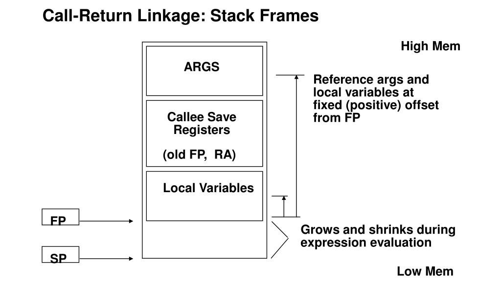

# Perceptron Training using MIPS

Training algorithm for single layer neural network using MIPS assembly language.

The program uses linear algebra (matrices, vectors and thier operations) to,implement the training algorithm.

Symbols:

- $`x`$: Input
- $`w`$: Weight
- $`b`$: Threshold/Bias
- $`s`$: Weighted Sum
- $`y`$: Output
- $`y_d`$: Desired Output
- $`\delta`$: Error
- $`\Delta w`$: Needed Change in Weight
- $`\Delta b`$: Needed Change in Threshold/Bias
- $`\beta`$: Momentum
- $`\alpha`$: Learning Rate
- $`\sigma`$: Weighted Average of the Squared Change in Weights or Thresholds/Bias
- $`t`$: number of passed iterations

## Transform

First we have the transform algorithm, which is used to transform the input vector (feature vector) into the output vector (classes vector) using the weights matrix as the change of bases matrix and then applying the activation function on the output vector. (i.e. predicts the classes given the features).

Starting by calculating the weighted sum of the neurons (by linearly transforming the feature vector with the weigths matrix and then subtracting the threshlods).

```math
w_{k \times j} \cdot x_{j} + b_{k} \cdot \left[ -1 \right] = s_{k}
```

Then we can apply the chosen activation function to the weighted sum in order to get the output of the transformation. The program allows you to define your own activation function as a function and then reference it with the training model and it'll be used for this stage. Also applying the activation function on the whole vector allowed us to,implement both single neuron and multi neuron activation functions. In the perceptron module you'll find two built-in activation functions, one is the hard limitter which is a single neuron activation function that returns 1 when the weighted sum is positive and 0 otherwise, and the other is the maximum weighted sum which is a multi neuron activation function that returns 1 for the neuron with maximum weghted sum and 0 for the other neurons.

```math
y_{k} = activation\left( s_{k} \right)
```

## Fit

In this part the weights matrix and the threshlods vector will be modified to reduce the error in the prediction. It iterates over the dataset, and in each iteration it will do the following for the corresponding data tuple:

- Transforms the feature vector using the existing model.
- Calculating the error between the desired output and the given output.

```math
\delta_{k} = y_{k} - {y_d}_{k}
```

- Calculating the needed change in the weights and the needed change in the thresholds.

```math
\Delta w_{o,i} \gets \beta \Delta w_{o,i} + \left( 1 - \beta \right)\frac{\partial L_{o}}{\partial w_{o,i}}
```

```math
\Delta w_{k \times j} \gets \beta \Delta w_{k \times j} + \left( 1 - \beta \right)\delta_{k} \cdot x_{j}^T
```

```math
\Delta b_{o} \gets \beta \Delta b_{o} + \left( 1 - \beta \right)\frac{\partial L_{o}}{\partial b_{o}}
```

```math
\Delta b_{k} \gets \beta \Delta b_{k} + \left( 1 - \beta \right)\delta_{k} \cdot \left[ -1 \right] ^T
```

```math
\Delta b_{k} \gets \beta \Delta b_{k} - \left( 1 - \beta \right)\delta_{k}
```

- Calculating the new learning rates using RMSProp

```math
\sigma_{o,i} \gets \beta \sigma_{o,i} + \left( 1 - \beta \right) \Delta w_{o,i}^2
```

```math
\sigma_{o} \gets \beta \sigma_{o} + \left( 1 - \beta \right) \Delta b_{o}^2
```

```math
\alpha_{o,i} = \frac{\alpha}{\sqrt{\sigma_{o} + \epsilon}}
```

```math
\alpha_{o} = \frac{\alpha}{\sqrt{\sigma_{o,i} + \epsilon}}
```

- Applying the Changes

```math
w_{k \times j} \gets w_{k \times j} - \alpha_{k \times j} \Delta w_{k \times j}
```

```math
b_{k} \gets b_{k} - \alpha_{k} \Delta b_{k}
```

The algorithm iterates over the entire dataset in one epoch, if more than one epoch are given it will re-iterate over the entire dataset as many epochs as the are.

## Program Modules

The program consists of four modules:

- `math_module` which contains some math utilities, basically a `sqrt` function that calculated the square root of a float number and a `pow_int` function that uses binary exponentiation to calculate the result of raising an integer to another integer power.
- `linalg_module` which contains all the functions needed to perform linear algebra operations. (Note: the function `vector_cross` has different definition than the original vector cross multiplication).
- `io_module` which contains all the functions needed to read data, parse it, store it in memory and some other functions for printing and debugging the vectors/matrices in readable way.
- `perceptron_module` which contains the `fit` and `transform` functions and the built-in activation functions.

Using these modules requires some predefined variables in `.data` section, refer `.data` section in `perceptron_module_test.s` for usage example.

The program starts by asking the user for some values and the input file. Refer `sample_input` and `sample_output` for some examples of I/O interaction with the program.

## Note

We uses some basic conventions that the GCC compiler uses when compiling to MIPS assembly:

- Call stack and Frames by making use of the `$fp` and `$sp` registers.
- Local variables, passed arguments (that doesn't fit in `$ax` registers), returned values (that doesn't fit in `$vx` registers) are stored in the frame of the function.



- The architecture of for loops, if statements and nesting them.

```assembly
sw $zero, 0($fp)      # int i = 0

j condition_ckeck

loop_body:
  # Here's the body of the loop

forward_iterator:
  lw $t0, 0($fp)
  addiu $t0, $t0, 1
  sw $t0, 0($fp)      # i++

check_condition:
  lw $t0, 0($fp)
  li $t1, 5
  slt $t0, $t0, $t1   # if i < 5
  bne loop_body       # continue the loop
  # else: break
```

Some of the comments contain the equivalent C code of the written MIPS assembly.

Each module has it's own testcase that covers the basic functionality of the module. Refer to the bash scripts located at `testcases` to generate the `main.s` file that contains that testcase.

## Future Work

- Add the trigonometric functions and the exponential function to `math_module`.
- Implement more activation functions (like `sigmoid`).
